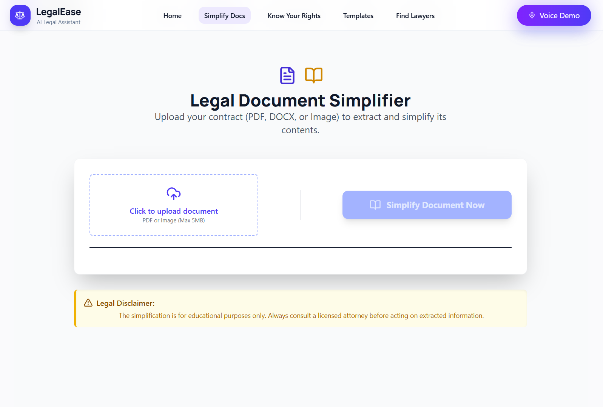
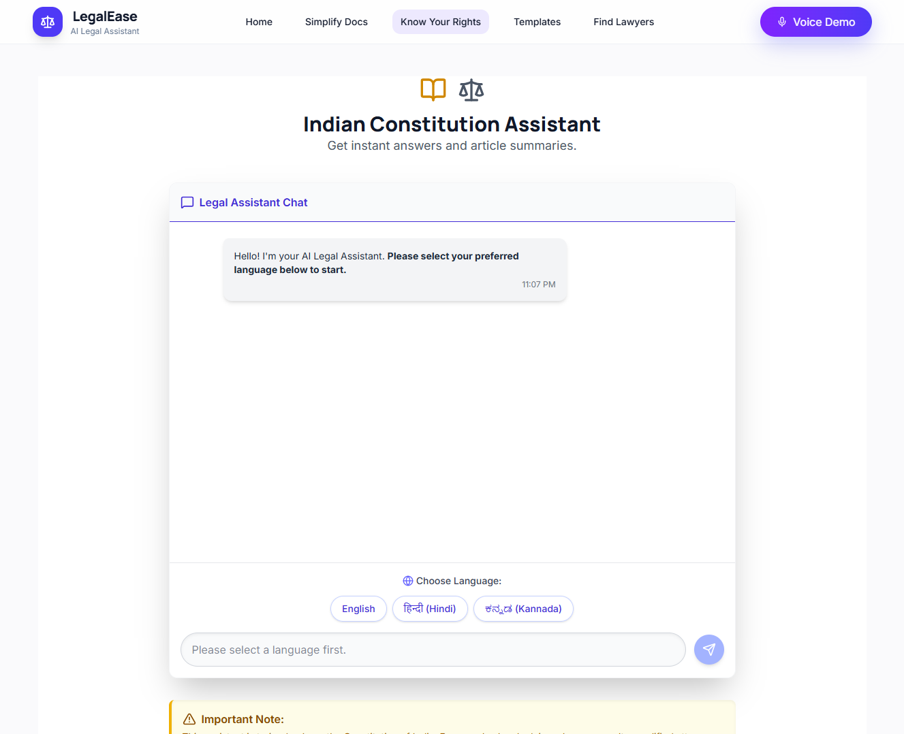
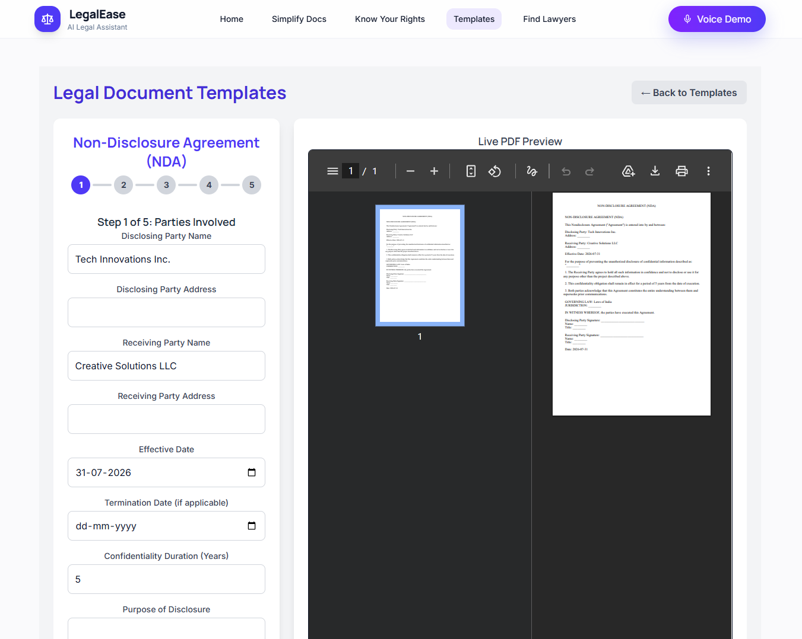

# LegalEase ⚖️

**Live Demo:** Coming Soon 🚀

LegalEase is an AI-powered legal assistant that helps users simplify legal documents, understand their legal rights, generate legal templates, and connect with trusted legal professionals.

---

## 📖 About

LegalEase is a full-stack AI-powered legal assistance platform designed to make legal information simple, accessible, and easy to understand. It bridges the gap between complex legal language and everyday users by providing AI-driven legal assistance through a clean and responsive interface.

The platform enables users to:
- Simplify complex legal documents
- Understand their legal rights using AI
- Generate legal document templates
- Find trusted lawyers

---

## ✨ Features

- 📄 AI Document Simplifier
- ⚖️ Know Your Rights (AI Chatbot)
- 📝 Legal Template Generator
- 👨‍⚖️ Find Lawyers
- 🔒 Secure & Privacy Focused
- 📱 Fully Responsive Design

---

## 🛠️ Tech Stack

### Frontend
- React.js
- Vite
- Tailwind CSS
- Framer Motion
- Lucide React

### Backend
- Node.js
- Express.js

### Database
- MySQL

### AI Services
- Google Gemini API
- NVIDIA API

---

## 🎬 Demo

**Live Demo:** Coming Soon

### Landing Page


### Document Simplifier



### Know Your Rights



### Legal Templates



### Find Lawyers


---

## 🚀 Quick Start

Clone the repository

```bash
git clone https://github.com/harshhgowda26/LegalEase.git
cd LegalEase
```

### Backend

```bash
cd backend
npm install
npm start
```

### Frontend

```bash
cd ../Frontend
npm install
npm run dev
```

Open the application:

Frontend

```
http://localhost:5173
```

Backend

```
http://localhost:3000
```

---

## 📦 Installation

### Prerequisites

- Node.js (v18 or later)
- npm
- MySQL
- Git

### Install Backend

```bash
cd backend
npm install
```

### Install Frontend

```bash
cd Frontend
npm install
```

### Run Backend

```bash
npm start
```

### Run Frontend

```bash
npm run dev
```

---

## ⚙️ Configuration

Create a `.env` file inside the `backend` directory using `.env.example`.

```env
# Google Gemini API
GEMINI_API_KEY=your_gemini_api_key

# NVIDIA API
NVIDIA_API_KEY=your_nvidia_api_key

# MySQL Configuration
DB_HOST=localhost
DB_USER=root
DB_PASSWORD=your_database_password
DB_NAME=legalease
DB_PORT=3306

# Backend
PORT=3000
```

---

## 📁 Project Structure

```text
LegalEase/
│
├── Frontend/
│   ├── src/
│   ├── public/
│   └── package.json
│
├── backend/
│   ├── routes/
│   ├── ai/
│   ├── server.js
│   ├── uploadFile.js
│   ├── package.json
│   └── .env.example
│
├── screenshots/
│   ├── landing-page.png
│   ├── document-simplifier.png
│   ├── know-your-rights.png
│   ├── legal-templates.png
│   └── find-lawyers.png
│
├── README.md
└── requirements.txt
```

---

## ❓ FAQ

### Is LegalEase a replacement for professional legal advice?

No. LegalEase provides general legal guidance and educational information. Always consult a qualified legal professional for official legal advice.

### Which AI model powers LegalEase?

Google Gemini AI powers the document simplification and legal assistance features.

### Is my data secure?

Yes. LegalEase follows a privacy-first approach and securely handles user data.

---

## 💬 Support

- **Email:** harshh.gowda.26@gmail.com
- **GitHub:** https://github.com/harshhgowda26
- **Issues:** https://github.com/harshhgowda26/LegalEase/issues

---

## 👨‍💻 Author

**Harsha L**

- GitHub: https://github.com/harshhgowda26
- LinkedIn: https://www.linkedin.com/in/harshaa26
- Email: harshh.gowda.26@gmail.com

---

## 🙏 Acknowledgments

- Google Gemini AI
- React.js
- Node.js
- Express.js
- Tailwind CSS
- MySQL
- Lucide React

---

## 📄 Disclaimer

LegalEase is developed for educational and informational purposes only. It should not be considered a substitute for professional legal advice. Always consult a licensed legal professional for legal matters.